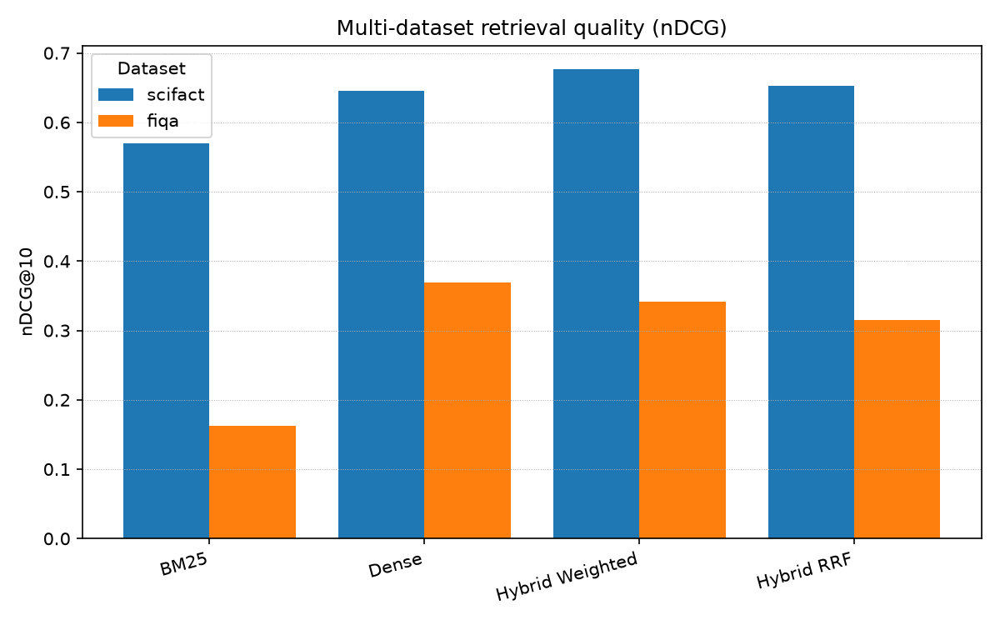
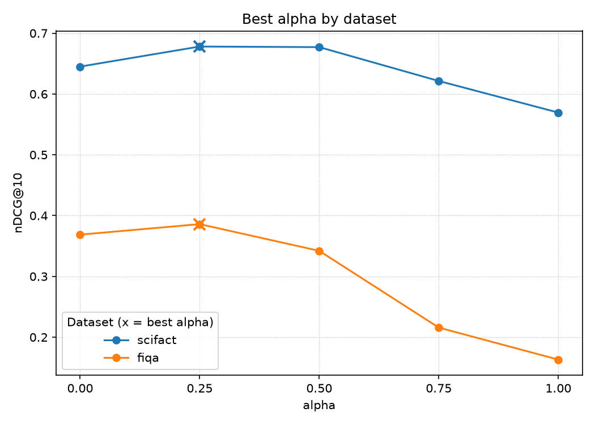
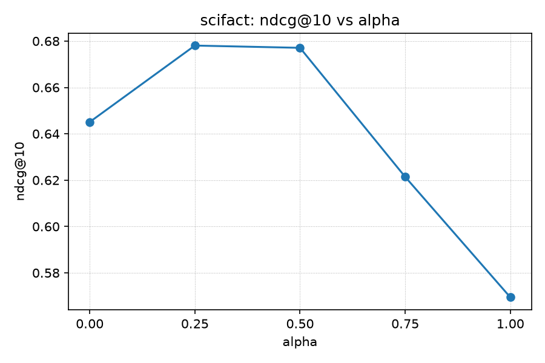
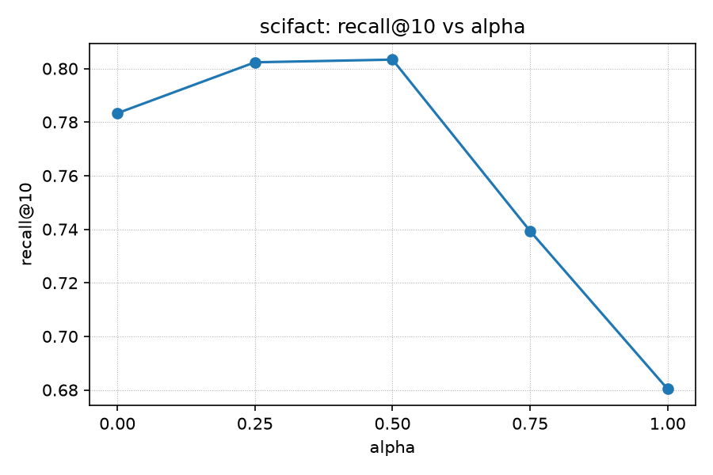
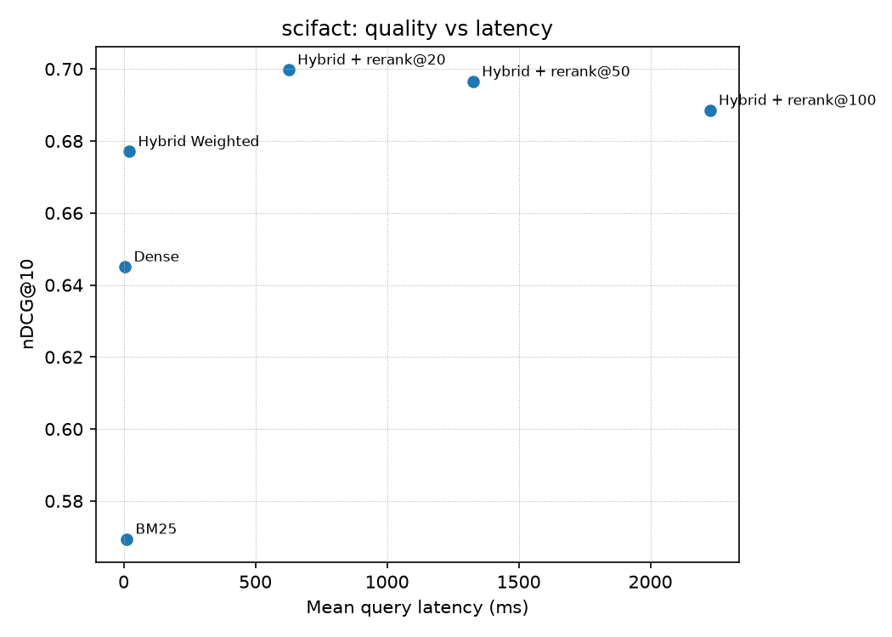
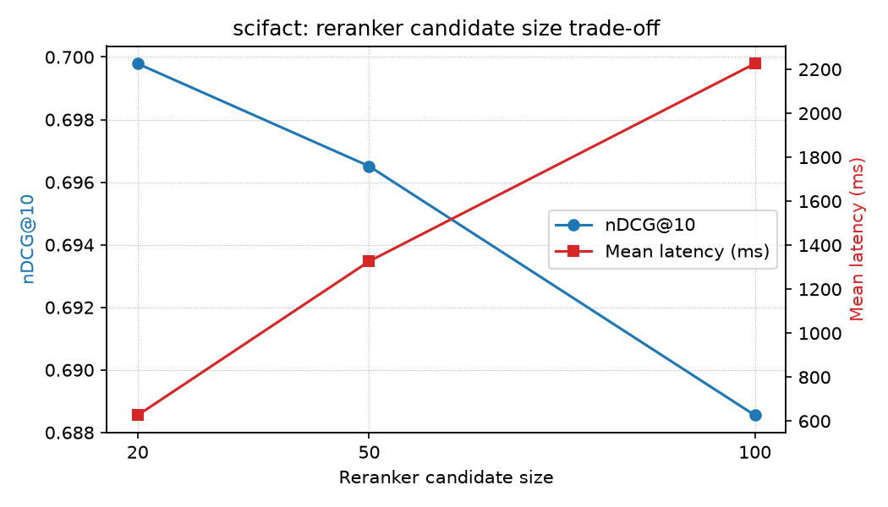
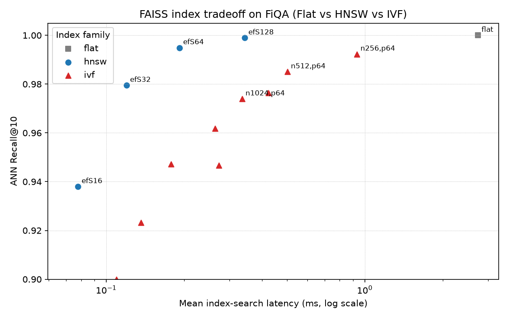
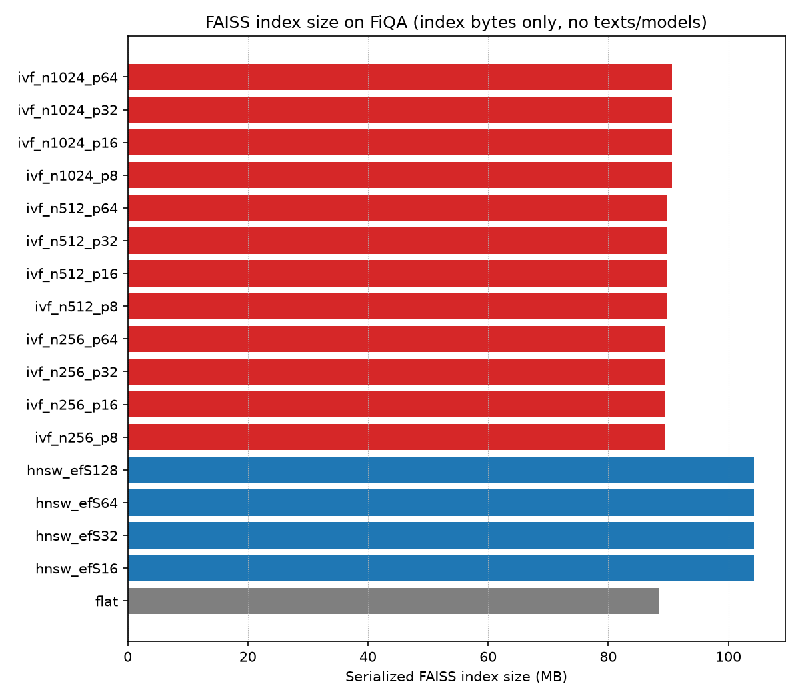
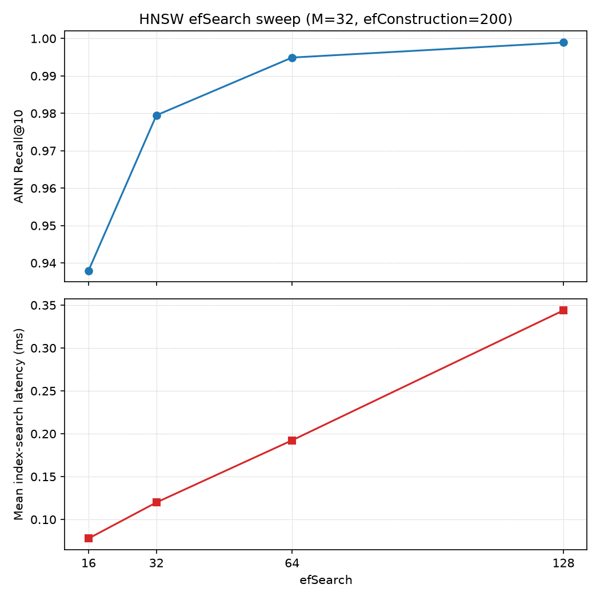
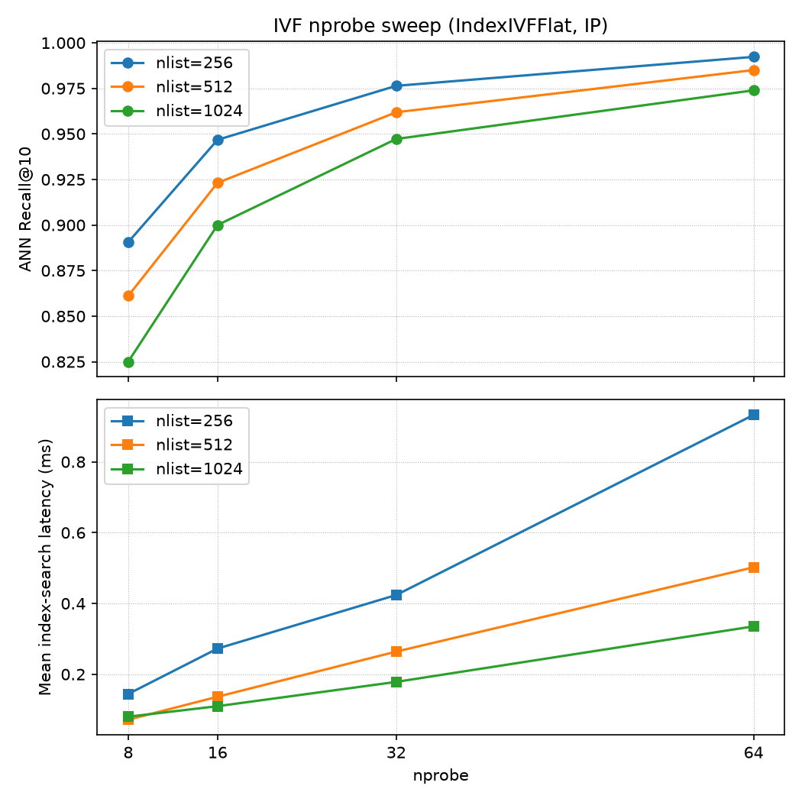

# HybridSearch-Bench

A reproducible, end-to-end information retrieval benchmark that compares sparse, dense, and hybrid retrieval with neural cross-encoder reranking across quality, latency, ablations, and failure modes.

## Overview

HybridSearch-Bench evaluates the core components of a modern retrieval stack — lexical search (BM25), semantic search (dense embeddings + FAISS), rank fusion (weighted and reciprocal rank fusion), and second-stage neural reranking (cross-encoder) — against the real qrels of the SciFact and FiQA datasets.

This is an information retrieval benchmark, **not** a RAG chatbot: there is no generation, no agent, and no frontend. The project focuses exclusively on retrieval, ranking, and evaluation.

Everything reported here is reproducible:

- every benchmark number is generated by a script, saved as JSON under `outputs/`, and never hard-coded;
- tie-breaking is fully deterministic (descending score, then ascending document id);
- the unit test suite runs offline and deterministically.

## Motivation

Retrieval quality depends on how lexical and semantic signals are combined, and on how much latency a pipeline can afford. A benchmark that measures each piece in isolation makes those trade-offs visible:

- **Lexical matching** — BM25 matches exact query tokens; it is strong on rare, precise terms and weak on paraphrases.
- **Semantic retrieval** — dense embeddings match meaning, not spelling; they handle paraphrases but can miss rare exact terms.
- **Sparse + dense complementarity** — the two signals agree on easy queries and disagree on hard ones; fusing them usually beats either alone.
- **Second-stage reranking** — a cross-encoder re-scores a candidate pool with far better precision than either first-stage retriever, at a far higher cost.
- **Quality / latency trade-offs** — choosing a retrieval stack is an engineering decision, so this project measures quality and query-time latency side by side.

## Architecture

```
Query
├── BM25
└── Dense + FAISS
       ↓
Weighted Fusion / RRF
       ↓
Candidate Set
       ↓
Cross-Encoder Reranker      (optional second stage)
       ↓
Top-K
       ↓
Evaluation
```

Each stage is an independent, swappable component: the fusion layer consumes raw score/rank maps, and the reranker consumes plain candidate dicts, so any retriever can feed any reranker.

## Dataset

SciFact is a scientific claim-verification corpus, loaded through the BEIR releases on Hugging Face:

| Part | Source | Size |
|---|---|---|
| Corpus | `BeIR/scifact`, config `corpus`, split `corpus` | 5,183 documents |
| Queries | `BeIR/scifact`, config `queries`, split `queries` | 1,109 queries |
| Qrels | `BeIR/scifact-qrels`, split `test` | 300 query ids, 339 judged pairs |

Evaluation uses the 300 queries that have qrels. Titles and bodies are joined per document, all ids are preserved as strings, and inconsistent records fail loudly instead of being dropped.

### FiQA

FiQA is a financial Q&A corpus (StackExchange personal-finance answers), also loaded through BEIR on Hugging Face:

| Part | Source | Size |
|---|---|---|
| Corpus | `BeIR/fiqa`, config `corpus`, split `corpus` | 57,638 documents |
| Queries | `BeIR/fiqa`, config `queries`, split `queries` | 6,648 queries |
| Qrels | `BeIR/fiqa-qrels`, split `test` | 648 query ids, 1,706 judged pairs |

FiQA documents have no titles and binary (0/1) qrels; the 38 published corpus posts with empty text are kept as-is, never silently dropped. SciFact remains the primary deep-analysis dataset; FiQA is used for cross-dataset robustness validation.

## Methods

### BM25

An in-memory Okapi BM25 implemented from scratch (`k1 = 1.5`, `b = 0.75`, smoothed idf). Sparse lexical matching over exact query tokens — the classic strong baseline.

### Dense Retrieval

- encoder: `sentence-transformers/all-MiniLM-L6-v2`
- the corpus is encoded once at index build and L2-normalized
- FAISS `IndexFlatIP`: with normalized vectors, inner product equals cosine similarity
- each query is encoded and normalized at search time

### Hybrid Weighted Fusion

```
hybrid_score = alpha * normalized_bm25 + (1 - alpha) * normalized_dense
```

Each retriever's scores are min-max normalized per query before fusion; a document missing from one list contributes `0.0` from that side. Default `alpha = 0.5`.

### Reciprocal Rank Fusion

```
RRF(d) = Σ_i 1 / (k + rank_i(d))
```

Rank-based fusion over the union of the two ranked lists, with default `k = 60`. It needs no score calibration because only ranks are used.

### Cross-Encoder Reranking

Model: `cross-encoder/ms-marco-MiniLM-L-6-v2`.

Retrieval produces a candidate pool (the hybrid retriever's top-N), the cross-encoder jointly scores every `(query, document)` pair, and the pool is re-ordered to the final top-K. The reranker is fully compositional: it knows nothing about how the candidates were retrieved.

## Evaluation Metrics

| Metric | What it measures |
|---|---|
| Precision@10 | fraction of the top-10 results that are relevant |
| Recall@10 | fraction of all relevant documents found within the top-10 |
| MRR@10 | reciprocal rank of the first relevant document, averaged over queries |
| nDCG@10 | graded relevance (`gain = 2^rel - 1`) with logarithmic position discount, normalized against the ideal ranking |

All metrics are implemented from scratch in `hybridsearch/evaluation/metrics.py`.

## Main Benchmark Results

Full 300-query SciFact evaluation with `k = 10`, `alpha = 0.5`, RRF `k = 60`, hybrid `candidate_k = 50`, reranker pool `= 20`:

| Method | Precision@10 | Recall@10 | MRR@10 | nDCG@10 |
|---|---:|---:|---:|---:|
| BM25 | 0.0760 | 0.6803 | 0.5381 | 0.5694 |
| Dense | 0.0883 | 0.7833 | 0.6047 | 0.6451 |
| Hybrid Weighted | 0.0907 | 0.8033 | 0.6413 | 0.6771 |
| Hybrid RRF | 0.0880 | 0.7902 | 0.6139 | 0.6522 |
| Hybrid Weighted + Rerank@20 | 0.0937 | 0.8356 | 0.6664 | 0.6998 |

Numbers reproduced from the generated artifacts `outputs/scifact_reranker_benchmark.json` and `outputs/scifact_quality_latency.json` (`outputs/` is gitignored; the scripts regenerate them).

On SciFact, **Hybrid Weighted + rerank@20 is the strongest tested configuration among these methods**, improving every metric over retrieval alone. This statement is scoped to SciFact and this exact setup — it is not a claim of universal superiority.

## Multi-Dataset Results

FiQA is the second real dataset: SciFact stays the primary deep-analysis dataset, while FiQA checks whether the SciFact conclusions generalize to a different domain (financial Q&A). Both datasets use the identical methods, defaults, and evaluation protocol.

Retrieval-only comparison, full runs (`k = 10`, `alpha = 0.5`, RRF `k = 60`, hybrid `candidate_k = 50`):

| Dataset | Method | Precision@10 | Recall@10 | MRR@10 | nDCG@10 |
|---|---:|---:|---:|---:|---:|
| SciFact | BM25 | 0.0760 | 0.6803 | 0.5381 | 0.5694 |
| SciFact | Dense | 0.0883 | 0.7833 | 0.6047 | 0.6451 |
| SciFact | Hybrid Weighted | 0.0907 | 0.8033 | 0.6413 | 0.6771 |
| SciFact | Hybrid RRF | 0.0880 | 0.7902 | 0.6139 | 0.6522 |
| FiQA | BM25 | 0.0461 | 0.2101 | 0.2044 | 0.1631 |
| FiQA | Dense | 0.1045 | 0.4413 | 0.4451 | 0.3687 |
| FiQA | Hybrid Weighted | 0.0991 | 0.4294 | 0.4068 | 0.3420 |
| FiQA | Hybrid RRF | 0.0920 | 0.4017 | 0.3817 | 0.3150 |

The SciFact rows are the retrieval-only rows of the full SciFact reranker-benchmark payload (`outputs/scifact_reranker_benchmark.json`, hybrid candidate pool 50) and the FiQA rows come from `outputs/fiqa_benchmark.json` (hybrid candidate pool 50) — identical retrieval semantics on both datasets.



Best weighted-fusion alpha per dataset (full grid `0.00`-`1.00`, step `0.25`):

| Dataset | Best alpha | nDCG@10 at best |
|---|---:|---:|
| SciFact | 0.25 | 0.6781 |
| FiQA | 0.25 | 0.3860 |



Reranking comparison — canonical configuration: Hybrid Weighted with hybrid fusion pool 50 + cross-encoder `rerank@20`, final `k = 10` (same quality/latency script, full runs, on both datasets):

| Dataset | Hybrid Weighted nDCG@10 | + rerank@20 nDCG@10 | Mean rerank latency |
|---|---:|---:|---:|
| SciFact | 0.6771 | 0.6998 | 626.40 ms |
| FiQA | 0.3420 | 0.3784 | 812.56 ms |

**Reranker candidate-pool semantics.** `experiments/reranker_benchmark.py` couples one knob (`--candidate-k` = hybrid fusion pool AND reranker pool), while `experiments/quality_latency.py` decouples them (`--hybrid-candidate-k` 50 + `--candidate-sizes`). The full FiQA reranker-benchmark payload therefore used pool 20 for both stages: Hybrid Weighted 0.3390 -> reranked 0.3735 nDCG@10, versus 0.3420 -> 0.3784 with the canonical pool-50 fusion in the table above. That difference is expected — weighted fusion min-max-normalizes over the fetched pool (20+20 vs 50+50 documents), so the fused order, and hence the 20 candidates handed to the reranker, differs. Every reranker claim in this README uses the canonical pool-50 + rerank@20 configuration.

Cross-dataset observations (actual data only, no claims of generality):

- **Dense beats BM25 on both datasets**, but the gap is far larger on FiQA (nDCG@10 0.3687 vs 0.1631) than on SciFact (0.6451 vs 0.5694).
- **Hybrid Weighted at the default `alpha = 0.5` beats the strongest single retriever on SciFact but not on FiQA** (0.6771 > 0.6451; 0.3420 < 0.3687). At each dataset's best alpha, hybrid edges out dense on both (SciFact 0.6781 vs 0.6451; FiQA 0.3860 vs 0.3687).
- **The best alpha is 0.25 on both datasets, but the curve shapes differ**: on FiQA quality collapses steeply toward BM25-heavy fusion (0.1631 at `alpha = 1.0` vs 0.5694 on SciFact), so FiQA depends far more on the dense signal.
- **RRF behaves consistently relative to weighted fusion**: weighted nDCG@10 exceeds RRF on both datasets (0.6771 vs 0.6522; 0.3420 vs 0.3150).
- **Reranking improves both datasets** (canonical pool-50 + rerank@20 configuration), and the nDCG gain is relatively larger on FiQA (+0.0364, ~10.6%) than on SciFact (+0.0227, ~3.4%).
- **Failure patterns differ qualitatively**: on SciFact, 37/300 queries (12.3%) are missed by every method (Recall@10 = 0) and per-query Dense beats BM25 92 vs 54 times (from `outputs/scifact_failure_analysis.json`); FiQA's aggregate gap is far larger (BM25 nDCG@10 0.1631 vs Dense 0.3687), so BM25 is much weaker on FiQA than on SciFact (0.1631 vs 0.5694). Per-query failure counts are tracked for SciFact only.

The benchmark numbers come from the generated artifacts under `outputs/` (`scifact_*` / `fiqa_*`); the cross-dataset table and both figures are produced by `python experiments/multidataset_summary.py` and saved to `outputs/multidataset_summary.json`.

## Fusion Alpha Ablation

Weighted hybrid quality across the alpha grid (`alpha = 1` is pure BM25, `alpha = 0` is pure dense):

| Alpha | Precision@10 | Recall@10 | MRR@10 | nDCG@10 |
|---:|---:|---:|---:|---:|
| 0.00 | 0.0883 | 0.7833 | 0.6047 | 0.6451 |
| 0.25 | 0.0910 | 0.8023 | 0.6404 | 0.6781 |
| 0.50 | 0.0907 | 0.8033 | 0.6413 | 0.6771 |
| 0.75 | 0.0827 | 0.7393 | 0.5876 | 0.6214 |
| 1.00 | 0.0760 | 0.6803 | 0.5381 | 0.5694 |





Precision and MRR curves exist too: `assets/figures/fusion_alpha_precision.png`, `assets/figures/fusion_alpha_mrr.png`.

Key interpretation:

- the best region is around `alpha = 0.25–0.50` — SciFact favors a dense-heavy hybrid;
- `alpha = 0.5` remains a strong default;
- different metrics prefer slightly different alpha (recall peaks at 0.50, precision and nDCG at 0.25);
- these conclusions do not generalize beyond SciFact.

## Quality vs Latency

Quality and query-time latency on the same 300 SciFact queries. All rerank@N rows use the same upstream retrieval/fusion configuration: BM25 and Dense each fetch exactly 50 candidates, the same per-query normalization and weighted fusion produce the upstream ranking, and only the first N candidates from that ranking are passed to the cross-encoder and reranked to the final top-10. The rows therefore isolate the reranker candidate-prefix size rather than changing retrieval depth or fusion normalization.

| Method | Precision@10 | Recall@10 | MRR@10 | nDCG@10 | Mean ms | Median ms | P95 ms |
|---|---:|---:|---:|---:|---:|---:|---:|
| BM25 | 0.0760 | 0.6803 | 0.5381 | 0.5694 | 11.37 | 10.72 | 19.88 |
| Dense | 0.0883 | 0.7833 | 0.6047 | 0.6451 | 5.25 | 5.07 | 7.76 |
| Hybrid Weighted | 0.0907 | 0.8033 | 0.6413 | 0.6771 | 20.98 | 20.18 | 31.33 |
| Hybrid + rerank@20 | 0.0937 | 0.8356 | 0.6664 | 0.6998 | 626.40 | 636.60 | 679.21 |
| Hybrid + rerank@50 | 0.0927 | 0.8239 | 0.6661 | 0.6965 | 1326.63 | 1316.87 | 1483.05 |
| Hybrid + rerank@100 | 0.0910 | 0.8072 | 0.6589 | 0.6886 | 2225.72 | 2231.82 | 2604.04 |

Timing methodology:

- single-machine CPU / WSL measurements of these reference implementations; BM25 here is an in-process Python implementation, not a production search engine;
- query-time only — dataset loading, index construction, dense corpus encoding, FAISS build, and model loading are excluded;
- measured with `time.perf_counter`;
- 3 untimed warmup queries per method, then one timed pass (samples = number of queries);
- absolute latency and differences across runs are machine- and environment-dependent — compare relative magnitudes within a run, not the absolute values as portable performance guarantees.





Careful interpretation:

- rerank@20 gives the best tested quality among candidate sizes 20 / 50 / 100;
- reranking produces a substantial quality gain but a very large CPU latency cost in this run (about 30x hybrid retrieval at rerank@20, growing to roughly 106x at rerank@100);
- larger candidate pools did **not** improve quality in this setup;
- one possible explanation is that the cross-encoder's scores on out-of-domain scientific claims are noisy and reorder near-tied candidates — this is a hypothesis, not a demonstrated cause.

## FAISS Index Study

Beyond the Flat exact-search index used by every retrieval benchmark, the FAISS index study compares index configurations on the full FiQA set (57,638 documents, 648 judged queries, `k = 10`):

- **Flat** (`IndexFlatIP`) is the exact nearest-neighbor reference — ANN Recall@10 = 1.0 by construction;
- **HNSW** (`IndexHNSWFlat`, inner product over L2-normalized embeddings) with M = 32, efConstruction = 200, efSearch in {16, 32, 64, 128};
- **IVF** (`IndexIVFFlat`, IP, trained on the corpus) with nlist in {256, 512, 1024} × nprobe in {8, 16, 32, 64}.

ANN Recall@10 = |ANN top-10 ∩ Flat top-10| / 10 per query, macro-averaged over all 648 queries — it measures how closely an approximate index reproduces the exact neighbors and is **not** qrel relevance Recall@10. The corpus and all 648 query texts are encoded exactly once and the same float32 L2-normalized embeddings feed every configuration; encoding and model loading are excluded from all timings. Per-query latency covers only the FAISS search on precomputed query embeddings (3 untimed warmup passes + 5 timed passes per configuration; per-query latency = mean over passes). These are vector-index search latencies, not end-to-end semantic retrieval latency.

| Config | ANN R@10 | Queries ≥0.9 | Build s | Size MB | Mean ms | qrel nDCG@10 |
|---|---:|---:|---:|---:|---:|---:|
| flat | 1.0000 | 648 | 0.087 | 88.53 | 2.740 | 0.3687 |
| hnsw efS16 | 0.9380 | 557 | 3.207 | 104.22 | 0.078 | 0.3499 |
| hnsw efS32 | 0.9795 | 624 | 3.207 | 104.22 | 0.120 | 0.3614 |
| hnsw efS64 | 0.9949 | 643 | 3.207 | 104.22 | 0.192 | 0.3649 |
| hnsw efS128 | 0.9989 | 647 | 3.207 | 104.22 | 0.344 | 0.3671 |
| ivf n256 p8 | 0.8906 | 477 | 1.303 | 89.39 | 0.144 | 0.3358 |
| ivf n256 p16 | 0.9468 | 561 | 1.303 | 89.39 | 0.272 | 0.3524 |
| ivf n256 p32 | 0.9764 | 612 | 1.303 | 89.39 | 0.424 | 0.3596 |
| ivf n256 p64 | 0.9923 | 642 | 1.303 | 89.39 | 0.932 | 0.3663 |
| ivf n512 p8 | 0.8611 | 429 | 2.883 | 89.78 | 0.072 | 0.3289 |
| ivf n512 p16 | 0.9231 | 520 | 2.883 | 89.78 | 0.137 | 0.3436 |
| ivf n512 p32 | 0.9619 | 595 | 2.883 | 89.78 | 0.264 | 0.3567 |
| ivf n512 p64 | 0.9850 | 631 | 2.883 | 89.78 | 0.502 | 0.3625 |
| ivf n1024 p8 | 0.8250 | 373 | 5.335 | 90.57 | 0.080 | 0.3217 |
| ivf n1024 p16 | 0.9000 | 489 | 5.335 | 90.57 | 0.110 | 0.3367 |
| ivf n1024 p32 | 0.9472 | 570 | 5.335 | 90.57 | 0.178 | 0.3510 |
| ivf n1024 p64 | 0.9739 | 612 | 5.335 | 90.57 | 0.335 | 0.3569 |









Observed FiQA operating points for this embedding model, this machine, and this tested grid (not claims of universal optimality):

- **HNSW efSearch = 64** is the best observed speed/recall tradeoff in this tested grid: 0.9949 ANN Recall@10 (643/648 queries ≥ 0.9) at 0.192 ms mean index-search latency — about 14.2× faster than Flat's 2.740 ms for a 0.0051 recall loss; qrel nDCG@10 moves from 0.3687 to 0.3649. efSearch = 128 raises recall to 0.9989 at 0.344 ms when recall is prioritized. At roughly comparable high recall in this grid, HNSW efSearch=64 is faster than the IVF nprobe=64 configurations (0.192 ms vs 0.502–0.932 ms for the two IVF points nearest 0.99 recall).
- **IVF nlist = 512, nprobe = 64** is the best observed IVF tradeoff in this tested grid: 0.9850 recall at 0.502 ms (about 5.5× faster than Flat). nlist = 1024, nprobe = 64 trades recall down to 0.9739 for 0.335 ms; nlist = 256, nprobe = 64 is the highest-recall IVF point (0.9923) at 0.932 ms. In this grid, larger nlist means finer partitioning (more cells): at a fixed nprobe it searches a smaller fraction of the corpus, which lowered ANN recall at every nprobe (e.g. at nprobe = 64: 0.9923 → 0.9850 → 0.9739 for nlist 256 → 512 → 1024) while also lowering latency.

The secondary qrel diagnostic shows aggressive ANN settings do move relevance: qrel nDCG@10 ranges from 0.3217 (ivf n1024 p8) to the Flat 0.3687 (which matches the FiQA Dense benchmark exactly), so recall-optimized configurations matter in practice, not only for the approximation metric.

Limitations:

- results are specific to FiQA, this embedding model (`sentence-transformers/all-MiniLM-L6-v2`, 384-d), and this machine;
- the study covers Flat/HNSW/IVF-Flat only — no PQ/OPQ, no GPU, no larger ANN sweep;
- reported latencies are FAISS index-search only; end-to-end dense retrieval latency is dominated by query encoding on CPU.

## Failure Analysis

Per-query failure analysis over the same 300 queries (comparison metric: nDCG@10):

| Category | Queries |
|---|---:|
| BM25 wins, Dense loses | 54 |
| Dense wins, BM25 loses | 92 |
| Hybrid strictly beats both | 18 |
| Reranker improves nDCG@10 | 62 |
| Reranker hurts nDCG@10 | 49 |
| All methods miss (Recall@10 = 0) | 37 |

One compact representative example:

> **Query 1024** — "Recurrent mutations occur frequently within CTCF anchor sites adjacent to oncogenes." BM25 ranks the only relevant document #1 (nDCG@10 = 1.0000) while Dense misses it entirely (nDCG@10 = 0.0000). Observation: the query shares 6 of 11 unique tokens verbatim with the relevant document. That overlap is consistent with BM25 winning, but overlap alone does not prove causation.

The full per-query report separates **observations** from **hypotheses** and covers every category with ranked examples: [analysis/failure_analysis.md](analysis/failure_analysis.md) (machine-generated by `python experiments/failure_analysis.py`).

## Installation

```bash
git clone https://github.com/zhihaochen67/hybridsearch-bench.git
cd hybridsearch-bench

python -m venv .venv
source .venv/bin/activate        # Windows: .venv\Scripts\activate
pip install -e .
```

- Python >= 3.11 (tested with 3.13);
- all dependencies install from `pyproject.toml` — no separate `requirements.txt` is needed;
- the first network use downloads SciFact/FiQA and the pretrained models, which are then cached locally.

## Quick Start

Run the test suite:

```bash
python -m pytest -q
```

Toy demos on a tiny built-in corpus (the dense/hybrid/reranker demos load the real pretrained models):

```bash
python -m hybridsearch.retrieval.bm25
python -m hybridsearch.retrieval.dense
python -m hybridsearch.retrieval.hybrid
python -m hybridsearch.ranking.reranker
```

Experiments (each accepts `--help`):

```bash
python experiments/benchmark.py           # BM25 / Dense / Hybrid on SciFact
python experiments/benchmark.py --dataset fiqa   # same benchmark on FiQA
python experiments/fusion_ablation.py     # alpha grid + figures
python experiments/latency_benchmark.py   # per-query retrieval latency
python experiments/reranker_benchmark.py  # reranking quality
python experiments/quality_latency.py     # quality vs latency, candidate sizes
python experiments/faiss_index_benchmark.py --dataset fiqa  # FAISS index comparison (Flat/HNSW/IVF)
python experiments/failure_analysis.py    # per-query failure report (SciFact)
python experiments/multidataset_summary.py \
    --benchmarks outputs/scifact_reranker_benchmark.json outputs/fiqa_benchmark.json \
    --ablations outputs/scifact_fusion_ablation.json outputs/fiqa_fusion_ablation.json
```

Use `--max-queries 20` for a fast smoke run. Full runs evaluate all qrels queries — 300 on SciFact, 648 on FiQA — and save dataset-scoped JSON under `outputs/`; the full fusion, quality/latency, and FAISS study runs also (re)generate the figures in `assets/figures/`. The experiment scripts work without installation too — they add the repository root to `sys.path` — but `pip install -e .` is the supported setup.

## Reproducibility

- datasets: `BeIR/scifact` (corpus, queries) + `BeIR/scifact-qrels` (test) and `BeIR/fiqa` (corpus, queries) + `BeIR/fiqa-qrels` (test);
- dense model: `sentence-transformers/all-MiniLM-L6-v2`;
- reranker model: `cross-encoder/ms-marco-MiniLM-L-6-v2`;
- evaluation cutoff `k = 10`;
- reranker candidate sizes: 20 / 50 / 100;
- FAISS index study: full FiQA (648 queries), k = 10; HNSW M=32 / efConstruction=200; IVF nlist 256/512/1024 x nprobe 8/16/32/64; 3 warmup + 5 timed passes;
- hybrid `alpha = 0.5` (ablation grid 0.00–1.00 in steps of 0.25);
- RRF `k = 60`;
- exact retrieval paths use deterministic tie-breaking: descending score, then ascending document id; approximate FAISS indexes do not carry the same global determinism guarantee across builds;
- exact benchmark reproduction also depends on dependency, dataset, model, FAISS, hardware, and OS/WSL versions; dataset and model identifiers are recorded, but their revisions are not pinned;
- results saved as pretty-printed JSON under `outputs/`;
- unit tests are offline and deterministic;
- benchmark numbers are generated by the scripts, never hard-coded in the docs;
- `outputs/` is gitignored.

## Project Structure

```
hybridsearch/            the Python package
  data/                  SciFact + FiQA loading/normalization, shared helpers, registry + toy corpus
  retrieval/             BM25, dense/FAISS, fusion, hybrid, simple token retrieval
  ranking/               cross-encoder reranker
  evaluation/            Precision / Recall / MRR / nDCG metrics
  indexing.py            inverted index over the toy corpus
experiments/             runnable benchmark, ablation, analysis, multi-dataset summary, and FAISS index study scripts
tests/                   offline deterministic pytest suite
analysis/                generated failure analysis report
assets/figures/          generated benchmark figures
```

## Testing

```bash
python -m pytest -q
```

407 tests pass, fully offline (no model or dataset downloads).

## Limitations

- two datasets so far — SciFact (primary deep-analysis dataset) and FiQA (cross-dataset robustness validation); other domains remain untested;
- the dense and reranker models are pretrained general models, not fine-tuned on either dataset;
- latency is a single-machine CPU/WSL measurement of the reference implementations, not a production-engine benchmark;
- candidate-size conclusions may differ with a different model, dataset, or hardware;
- the FAISS ANN coverage is the FiQA Flat/HNSW/IVF study above — no PQ/OPQ variants, no GPU, and no larger ANN sweep;
- no trained retriever or reranker;
- no distributed search engine.

## Future Work

- evaluation on NFCorpus and further domains;
- embedding model comparison;
- FAISS PQ/OPQ variants and a larger ANN sweep;
- query expansion;
- pseudo-relevance feedback;
- a larger-scale benchmark such as MS MARCO;
- an optional downstream RAG experiment.
